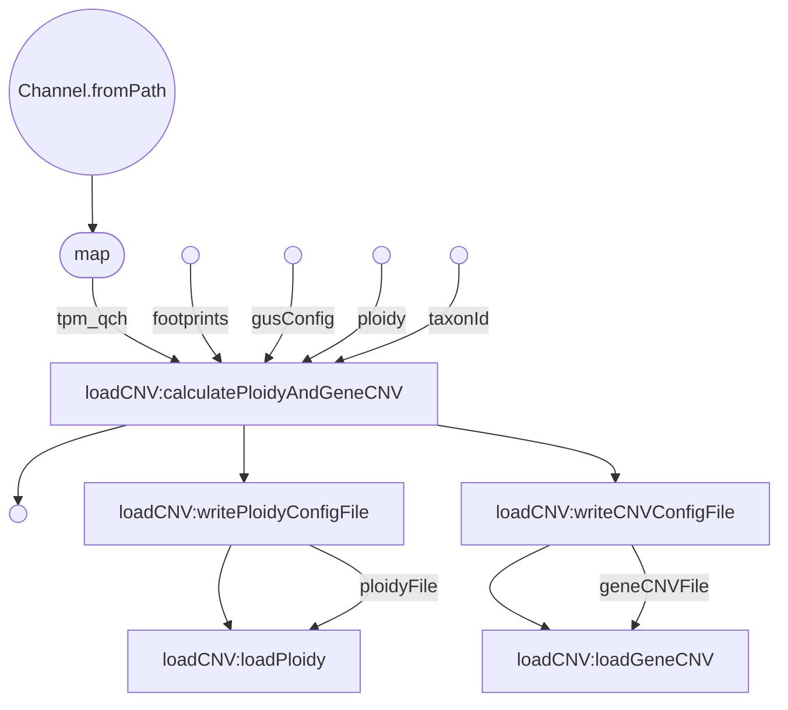
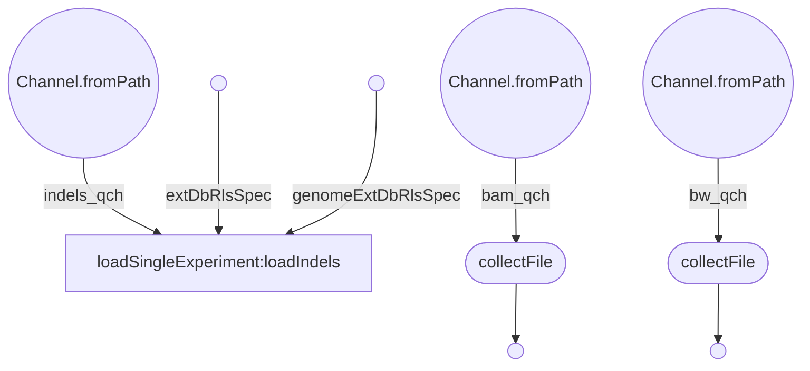

# 
dnaseqAnalysis Nextflow Workflows [^1]

[^1]: Both workflows are still in development   

***
processSingleExperiment
***  

This workflow will run on a per organism basis with multiple strains. Anyone can run this workflow, as it does not require a gus environment. The output from this process will either be sent to webservices, uploaded to various databases, and/or used in the mergeExperiments process.  
  

***
loadCNV
***  

***
loadSingleExperiment
***  

This work flow will run after processSingleExperiment. This workflow requires a gus environment to run. It will take the strain specific vcfs and consensus sequences output from the processSingleExperiment workflow. The strain specific vcfs will be merged together to create a merged vcf. This will be sent to webservices, along with being sent to snpEff to generate an annotated vcf file. The consensus sequences will be combined and sent to web services. These masked consensus sequences, along with various information queried from our databases will be used to generate a transcript fasta file that is indel and coverage aware. This will be used in downstream processes that still need to be generated.

***
mergeExperiments
***  

**
Explanation of Config File Parameters
**
---

Workflows: processSingleExperiment=ps; loadSingleExperiment=ls; loadCNV=lc; mergeExperiments=me;

| ps | ls | lc | me | Parameter | Value | Description |
| -- | -- | -- | -- | --------- | ----- | ----------- |
| X |   | X | X | outputDir | string path | Where you would like the output files to be stored |
| X | X | X |   | inputDir | string path | Path to the directory containing the strain specific fastqs and bam files (each strain has their own directory located inside the inputDir) |
| X |   |   |   | fromBAM | boolean | If true, samples will be retrieved from the strain specific bam files |
| X |   |   |   | hisat2Threads | int | Specifies NTHREADS parallel search threads count, to be used as argument -p when calling hisat2 |
| X |   |   |   | isPaired | boolean | (Assuming fromBam is false) Specifies if the samples are being retrieved from paired or unpaired fastq files |
| X |   |   |   | minCoverage | int | Sets the minimum coverage value, used in varscan (mpileup2snp, mpileup2indel, mpileup2cns) as well as the minimum coverage value used to determine masking when creating the consensus genome per strain |
| X |   |   | X | genomeFastaFile | string path | Path to the genome fasta file to be used as reference. Also used in used in snpEff database creation |
| X |   |   | X | gtfFile | string path | Path to the gtf file. Used in snpEff database creation (me) |
| X |   |   |   | winLen | int | Specifies the window length argument used in bin/makeWindowedBed.pl |
| X |   |   | X | ploidy | int | Ploidy Level |
| X |   |   |   | hisat2Index | string path | (Assuming createIndex is false) Location of the hisat2Index file  |
| X |   |   |   | createIndex | boolean | If true, will create the hisat2Index file | 
| X |   |   |   | trimmomaticAdaptorsFile | string path | Location of the trimmomatic adaptors file |
| X |   |   |   | varscanPValue | int | Sets the --p-value argument used in varscan mpileup2snp, mpileup2indel, and mpileup2cns |
| X |   |   |   | varscanMinVarFreqSnp | int | Sets the --min-var-freq argument used in varscan mpileup2snp |
| X |   |   |   | varscanMinVarFreqCons | int | Sets the --min-var-freq argument used in varscan mpileup2indel and mpileup2cns |
| X |   |   |   | maxNumberOfReads | int | Used in subSample process to limit total number of reads | 
| X |   | X |   | footprintFile | path | Path to gene footprints file |
|   |   |   | X | fastaDir | string path | Path to directory that contains the consensus fasta files output from processSingleExperiment |
|   |   |   | X | vcfDir | string path | Path to directory that contains the strain specific vcf files output from processSingleExperiment |
|   |   |   | X | makepositionarraycoding | string path | Path to makePotionArrayCoding.pl Leave as 'bin/makePositionArrayCoding', this parameter will most likely be removed in later updates |
|   |   | X | X | gusConfig | path | Path to gus.config file |
|   |   |   | X | cacheFile | path | Path to cache file |
|   |   |   | X | undoneStrains | path | Path to undoneStrains file |
|   |   |   | X | organism_abbrev | string | Organism Abbreviation Ex: 'lmajFriedlin' |
|   |   |   | X | reference_strain | string | Reference Strain Ex: 'Friedlin' |
|   |   |   | X | varscan_directory | path | Path to varscan coverage directory |
|   |   | X |   | taxonId | string | Taxon ID Ex: "1577702" |
|   | X |   | X | extDbRlsSpec | string | External database release spec. Ex: "lmajFriedlin_NGS_SNPsAndVariations|do_not_care" |
|   | X |   | X | genomeExtDbRlsSpec | string | Genome external database spec. Ex: "lmajFriedlin_primary_genome_RSRC|2016-05-28" |
|   | X |   |   | webServicesDir | path | Path to web services directory |
